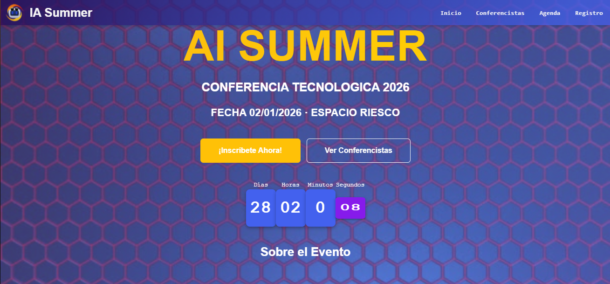

🚀 IA Summer 2026 - Landing Page

Landing page moderna y responsive para una conferencia tecnológica sobre Inteligencia Artificial. Diseñada para informar, captar atención y gestionar registros de usuarios de forma interactiva.

📌 Descripción

IA Summer 2026 es una landing page desarrollada como proyecto frontend que simula la promoción de una conferencia tecnológica.

El objetivo principal es:

Presentar información del evento
Mostrar conferencistas destacados
Visualizar la agenda
Permitir el registro de asistentes con validación en tiempo real

Este proyecto está enfocado en aplicar buenas prácticas de desarrollo frontend, diseño responsive y experiencia de usuario (UX).

🎯 Características principales
✅ Diseño completamente responsive
✅ Navegación fluida con smooth scroll
✅ Sección Hero con CTA (Call To Action)
✅ Cards dinámicas para conferencistas
✅ Agenda interactiva con Accordion
✅ Formulario con validación en tiempo real
✅ Feedback visual con Alert de Bootstrap
✅ Modal para registro de usuarios
✅ Contador regresivo animado (Flip Clock)
🛠️ Tecnologías utilizadas
HTML5 (estructura semántica)
CSS3 (estilos personalizados)
Bootstrap 5 (layout, componentes y utilidades)
JavaScript (ES6+)
jQuery (manipulación del DOM y eventos)
🧠 Decisiones técnicas
Se utilizó Bootstrap para acelerar el desarrollo UI manteniendo consistencia visual.
Se implementó validación en frontend para mejorar la experiencia del usuario.
Se integró jQuery para simplificar eventos y animaciones.
El contador tipo Flip Clock se desarrolló para aportar dinamismo y diferenciación visual.
📂 Estructura del proyecto
IA-SUMMER/
│
├── index.html
├── asset/
│   ├── css/
│   │   └── style.css
│   ├── js/
│   │   └── main.js
│   ├── img/
│   └── favicon/
│
└── README.md
⚙️ Instalación y ejecución
Clonar el repositorio:
git clone https://github.com/POLIVAF/ia-summer.git
Entrar al proyecto:
cd ia-summer
Abrir el archivo:
index.html

👉 No requiere backend ni instalación de dependencias.

🧪 Validaciones implementadas
Campos obligatorios
Validación de formato de email
Restricción de caracteres en nombre
Validación de teléfono
Feedback visual dinámico
⚠️ Desafíos y aprendizajes

Durante el desarrollo se enfrentaron varios desafíos:

🔹 Implementar un contador animado tipo flip clock
🔹 Manejar correctamente la validación sin recargar la página
🔹 Lograr un diseño completamente responsive
🔹 Estructurar correctamente componentes de Bootstrap (Accordion, Modal)

💡 Aprendizaje clave:

Planificar la estructura y los componentes antes de codificar reduce errores y mejora la calidad del resultado final.

📸 Demo

👉 ([https://ia-summer.vercel.app](https://efm2.vercel.app))

🎯 Problema que resuelve

Esta aplicación resuelve la necesidad de centralizar la información de un evento tecnológico en una sola plataforma clara y atractiva.

Actualmente, muchas conferencias presentan información dispersa o poco interactiva.
IA Summer permite:

Informar sobre el evento
Mostrar a los conferencistas
Presentar la agenda
Gestionar registros de usuarios

👉 Todo en una sola experiencia fluida y responsive.

⚙️ Funcionalidades

La aplicación incluye varias funcionalidades clave:

🧭 Navegación dinámica con smooth scroll entre secciones
🎤 Sección de conferencistas con cards responsivas
📅 Agenda interactiva usando accordion de Bootstrap
📝 Formulario de registro dentro de un modal
✅ Validación en tiempo real de los datos del usuario
🔔 Feedback visual mediante alertas dinámicas
⏳ Contador regresivo animado (Flip Clock) para el evento

👉 Todo diseñado con enfoque en experiencia de usuario (UX).

💻 Momento técnico (código)

Uno de los puntos más interesantes del proyecto es la validación del formulario con JavaScript, donde se controla la entrada del usuario sin recargar la página.

Por ejemplo:

```js
let nombre = $("#nombre").val().trim();
let email = $("#email").val().trim();

if (!email) {
  $("#email").after(
    '<div class="invalid-feedback d-block text-danger">Campo obligatorio</div>'
  );
} else {
  const regexEmail = /^[^\s@]+@[^\s@]+\.[A-Za-z]{2,}$/;
  if (!regexEmail.test(email)) {
    $("#email").after(
      '<div class="invalid-feedback d-block text-danger">Email inválido</div>'
    );
  }
}
```

👉 Aquí:

Se capturan los datos del usuario
Se validan en tiempo real
Se muestran errores dinámicos en la interfaz

Además, si todo es correcto:

```js
$("#alertaFormulario")
  .addClass("alert alert-success")
  .html("<strong>Reservación exitosa:</strong> Te has inscrito correctamente.");
```

👉 Esto mejora la experiencia del usuario sin recargar la página.

“Este proyecto demuestra cómo combinar Bootstrap con JavaScript para crear una experiencia interactiva, validada y lista para escalar a una aplicación fullstack.

👨‍💻 Autor

Pablo Olivares Figueroa
Desarrollador Fullstack JavaScript

📌 Estado del proyecto

✅ Proyecto finalizado (versión MVP)
🚀 Posibles mejoras futuras:

Integración con backend (Node.js / Express)
Base de datos para registros
Autenticación de usuarios
Panel administrativo

⭐ Conclusión

Este proyecto demuestra:
-Dominio de fundamentos frontend
-Uso correcto de Bootstrap
-Aplicación de lógica con JavaScript
-Buenas prácticas de UX/UI